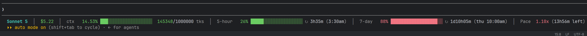

# claude-statusline

A custom status line for [Claude Code](https://claude.com/claude-code) showing model, cost, context window usage, rate limit windows (5-hour / 7-day), and a 7-day consumption pace indicator.



Left to right:

- **`Sonnet 5`** — the active model's display name.
- **`$5.22`** — total session cost (`cost.total_cost_usd`), colored green/yellow/red past $10/$20.
- **`ctx 14.53% [bar] 145348/1000000 tks`** — context window usage. The percentage and token count are computed directly from the current turn's token usage (input + output + cache read + cache creation) against the model's context window size, so it's precise to 2 decimal places. Bar and percentage are colored green/yellow/red/bright-red at 50/75/90% full.
- **`5-hour 26% [bar] ↻ 3h35m (3:30am)`** — the 5-hour rate limit window: percent used (as reported by the API — already whole-number precision, no decimals to be had), a bar colored green/yellow/red at 65/85% used, time remaining until this window resets, and the absolute reset time in parentheses.
- **`7-day 88% [bar] ↻ 1d10h05m (thu 10:00am)`** — same idea, for the rolling 7-day rate limit window.
  - Once either window's usage hits **100% or more**, its percent/bar is replaced with a bright-red **`EXTRA`** block instead of trying to render an over-full bar. The threshold is `>= 100` rather than `> 100` on purpose: the API reports `used_percentage` as a whole-number integer that appears to peg at 100 once you're actually blocked, rather than continuing to climb (101%, 105%, ...). Triggering strictly above 100 meant `EXTRA` could miss real over-limit states entirely; triggering at 100 means it might occasionally flip on a hair before you're truly maxed out, but that's the safer side to err on.
  - Whenever one window is in `EXTRA`, the *other* window (if it isn't also in `EXTRA`) is dimmed gray — a visual cue for which limit is actually the one blocking you.
- **`Pace 0.98x (2h41m surplus)`** — a projection of the 7-day window: your average usage rate so far, extrapolated across the full 7 days, expressed as a multiple of the sustainable rate (`1.00x` = using the budget exactly evenly). The multiplier and the trailing word are both colored the same way: **red** when overconsuming (you're burning budget faster than even pace — the `deficit` is roughly how much of the window you're on track to spend rate-limited at 0%), **blue** when underconsuming (`surplus` is the cushion you've banked ahead of an even pace), and **green** when on target. "On target" isn't exact-even pace — it's a grace window around it, and it's intentionally asymmetric: **+12h** of deficit before flipping to overconsuming (red), but **-24h** of surplus allowed before flipping to underconsuming (blue), since running out early is worse than sitting on unused budget.
  - Below **5%** 7-day usage, the multiplier gets a trailing **`*`** (e.g. `2.88x*`), always rendered plain white regardless of the multiplier's own color. The multiplier is a *rate* — `pct / elapsed_so_far` — and dividing by a tiny `elapsed_so_far` right after a window reset makes it swing wildly on very little data (a single 1%-used data point can already read as several multiples of sustainable pace). The `*` is a "take this with a grain of salt, it hasn't stabilized yet" flag; the deficit/surplus figure next to it isn't similarly affected since it accumulates with elapsed time rather than dividing by it.

The progress bars scale in five discrete steps (`xs`/`s`/`m`/`l`/`xl`) with the terminal's width, so wider terminals get more visual resolution without the bars trying to fill all available space.

## Setup

1. Copy `statusline-command.sh` and `statusline.py` into a directory of your choice.
2. Point Claude Code's `statusLine` config at the script, e.g. in `~/.claude/settings.json`:

   ```json
   "statusLine": {
     "type": "command",
     "command": "bash /path/to/statusline-command.sh"
   }
   ```

Requires `python3` (or `python`) on PATH. The wrapper script falls back gracefully if neither is found.

Set `STATUSLINE_DEBUG=1` to dump the raw session JSON Claude Code passes in to `statusline-debug.json` next to the script, for debugging.
